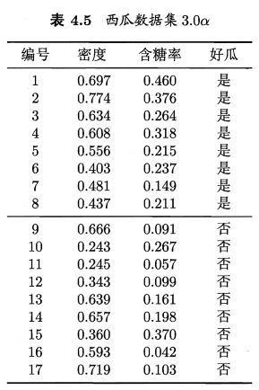
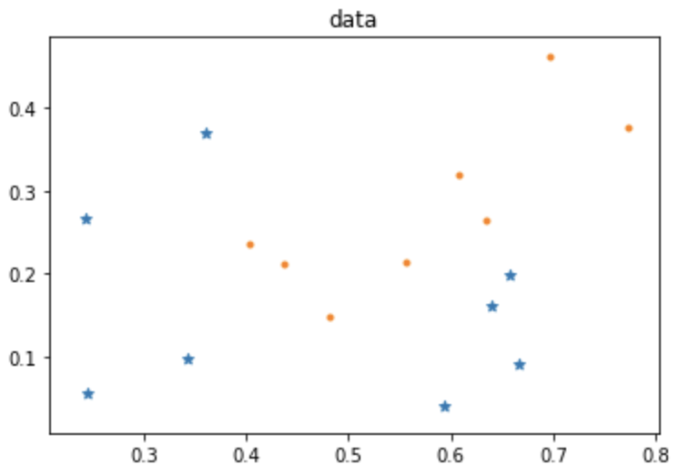
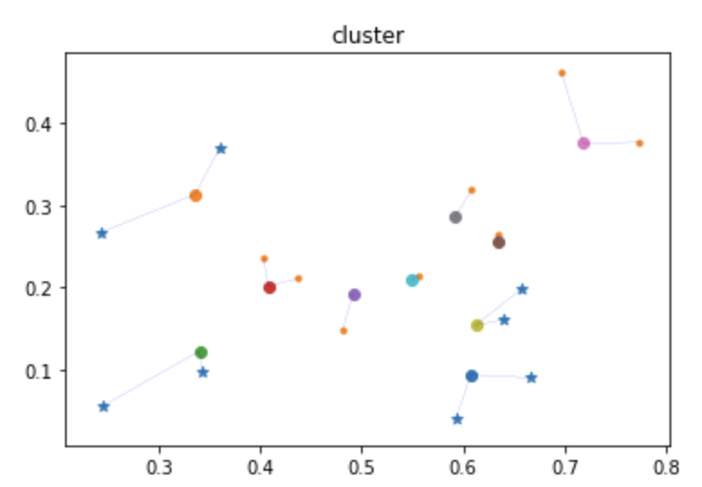
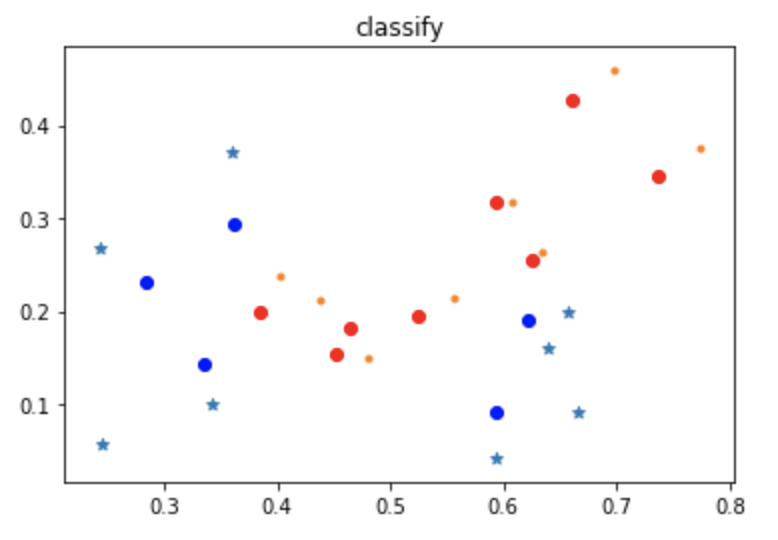
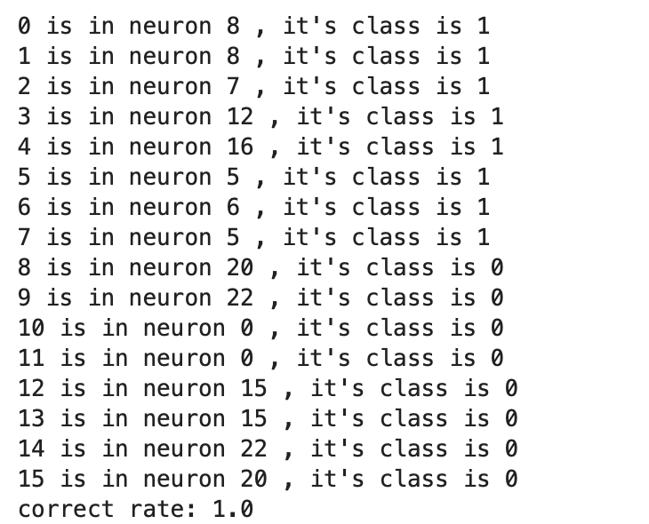

# 
SOM实现西瓜数据集分类和聚类
## 数据集

训练数据集采用西瓜书数据集，样本有17个，包含8个好瓜样本和9个坏瓜样本。
数据的特征是二维的，因此可以直接在平面中画出来，实际分布如下：

可见，数据集不是线性的，因此采用SOM可以较好的拟合特征。
## 代码实现
> 代码依赖：numpy matplotlib random

### 类的成员变量
out_layer: 输出层神经元的形状
data_set: 数据集
label_set:标签集
iteration: 迭代次数
weight: 随机权值矩阵
neuron_num: 输出神经元数量，具体值为out_layer的shape行列乘积
out_neuron: 输出层神经元，用来记录每个输出层神经元包含的输入神经元
### 类的成员函数
\_\_init\_\_:初始化变量成员
Geteta:根据两个迭代的次数和神经元与BMU之间的欧式距离得到学习率
Getneighbour:根据输出神经元间的欧式距离得到BMU周围的神经元
iterate:将所有数据输入并完成一次迭代更新
train:重复iterate函数，完成训练，建立模型
Getclass:根据输出神经元包含的输入数据的标签，得到输出神经元的类别
draw:画出聚类和分类的图像
predict:随机抽取数据集中的数据，进行输出映射检查模型的鲁棒性
### 实现细节
-  学习率eta的获取：
eta取决于输出神经元间的距离和迭代的次数，使用函数
$$\frac{e^{-dist}}{iter\times 3}(dist:距离，iter:迭代次数)$$
学习率最高为$\frac{1}{3}$,这个学习率只有在第一次迭代时的BMU神经元才可以取到。
- 近邻神经元的获取
    1. 首先指出神经元之间的距离定义
    跟据输出的神经元排列，即out_layer，我们假设每个输出神经元的位置就是out_layer的坐标位置，因此我们可以利用两点间的距离代替神经元间的距离
    2. TOP n 神经元的获得
    我们希望 TOP n 随着迭代的进行不断减小，在几何上表现为，以BMU为圆心的单位圆不断减小，因此，我们每次的近邻神经元取距离小于$f(iter)$的神经元，$f(iter)$是一个随着迭代次数增加而单调递减但是函数值非负的函数，简单地，我们取（总的迭代次数-当前迭代次数。
    3. 最终公式
    distance = norm(BMU.coord - neuron.coord)
    TOP n = [neuron if neuron.distance < iteration（总的迭代次数） - n(当前迭代次数)
    
    
## 结果分析
聚类结果，雪花为数据集，其颜色代表类别（尽管聚类是无监督的，我们还是希望找出聚类结果和数据标签之间的联系），圆点为输出层神经元，二者之间的连线代表了映射关系，由于数据集比较少，因此每次训练都会有变化，但是基本上聚类的结果都是数据标签集的子集。

分类结果，图中圆点为SOM的输出层神经元，红色和蓝色分别代表两种类别，雪花为数据集的分布（因为是二维数据，因此可以直接在平面内画出来），可见输出层对数据集的拟合比较好。

由于数据集比较少，我们将所有的样本都作为测试样本进行了测试，发现本次的训练与数据集拟合比较好，经过多次训练，我们训练的模型准确库总是在0.9以上，可见训练比较成功。
